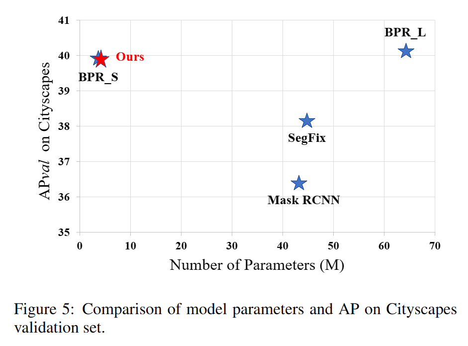
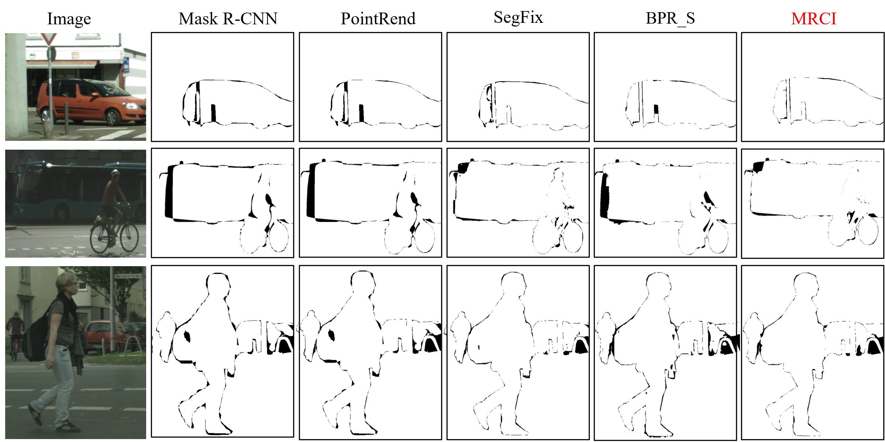

# MRCI: Multi-Range Context Interaction Network for Boundary Refinement

Training and inference code and weight will be open source soon.

> [**MRCI: Multi-Range Context Interaction Network for Boundary Refinement**](https://github.com/MRCI2023/MRCI)
>
> *IJCAI 2023 delivery*

## Introduction

The quality of current instance segmentation has been greatly improved, but the boundary accuracy is still unsatisfactory. In practice, the general,efficient and accurate post-processing refinement schemes are required. Most of existing boundary refinement approaches ignore different range contexts and global knowledge, causing low adaptability for various coarse segmentation errors. To address these issues, we propose a novel multi-range context interaction framework, MRCI, which aims to refine the boundaries of predicted masks with sufficient context knowledge and lower computational costs. We design a multi-range context-aware approach to extract richer local features and inject global knowledge prompt to guide boundary refinement. The proposed approach achieves impressive results on the popular Cityscapes dataset,obtaining tier-one AP value and highest AP50 value among the current state-of-the-art post-processing models with only 4M parameters.

For more details, please refer to our [paper]().

## Model  Parameters

We compare the parameters and accuracy of different methods on Cityscapes validation set.
Our model has much fewer parameters compared to BPR L and SegFix, and its AP is comparable to BPR S. This demonstrates that our model achieves a reasonable trade-off between accuracy and model size.

## Cityscapes Results

    note：MRCI is trained on the results of Mask R-CNN  and transfer to other models.

| method         | APval | APval50 | download results                                                                 |
| -------------- | ----- | ------- | -------------------------------------------------------------------------------- |
| Mask R-CNN     | 36.4  | 60.8    |                                                                                  |
| +Segfix        | 38.2  | 63.4    |                                                                                  |
| +MRCI          | 39.8  | 64.8    | [MRCI_MaskRCNN_APval398.zip](https://pan.baidu.com/s/17NOjDnX8Gu77gzEV0LlJtQ)       |
| +SegFix + MRCI | 40.0  | 64.5    | [MRCI_SegFix_AP_Val_400.zip](https://pan.baidu.com/s/1WYezsVMdRaPSp8ct9LaAsA)       |
| PointRend      | 37.9  | 63.7    |                                                                                  |
| +MRCI          | 40.3  | 64.8    | [MRCI_PointRend_AP_Val_403.zip](https://pan.baidu.com/s/1nG2onnGb8dZggzDMmLvsjA)    |
| +SegFix + MRCI | 40.9  | 65.0    | [MRCI_Point_Segfix_AP_val_409.zip](https://pan.baidu.com/s/1hfMHmTm8WUgJvoGgt7RN4A) |

Add: We newly added boundary AP and Boundery F-score indicators for instance segmentation and semantic segmentation respectively

## Qualitative Results

Qualitative results on Cityscapes validation set. Our proposed framework outperforms other methods on object boundaries of various categories and sizes.

Qualitative comparison in terms of errors on Cityscapes val. Our approach well addresses the existing boundary errors of various categories.

## Usage

This section will be updated soon.

## Citation

This section will be updated soon.
